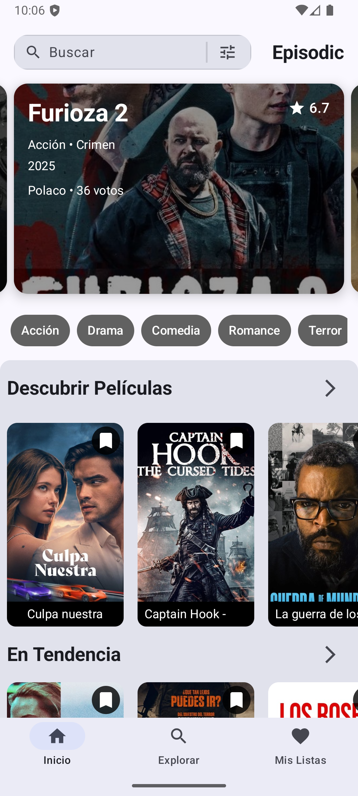
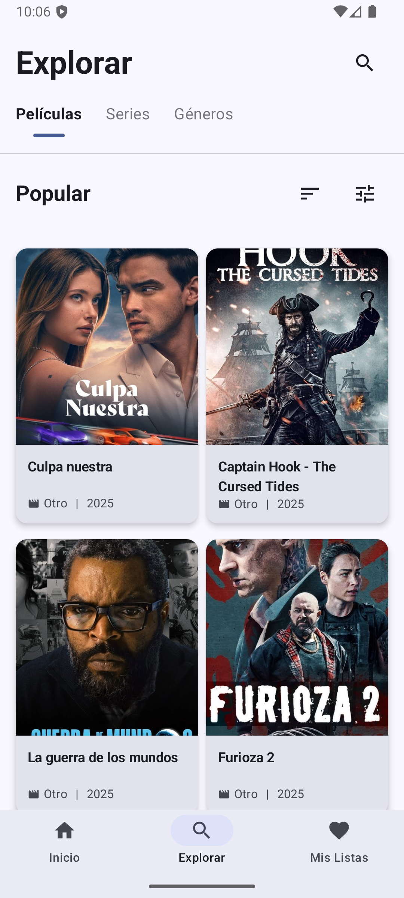
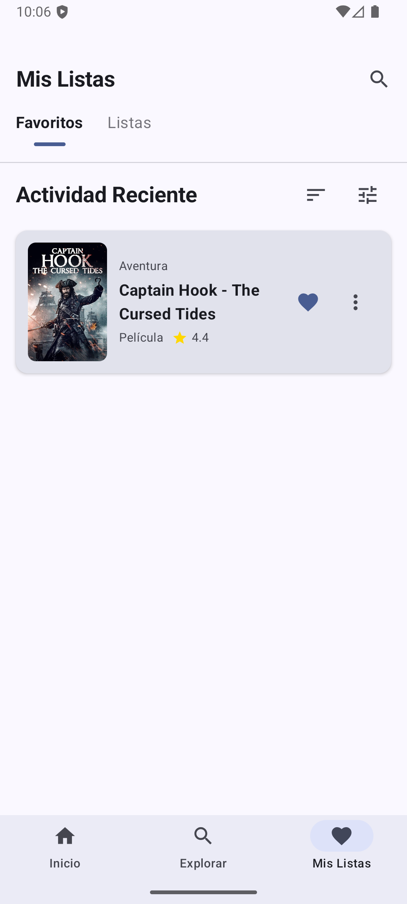
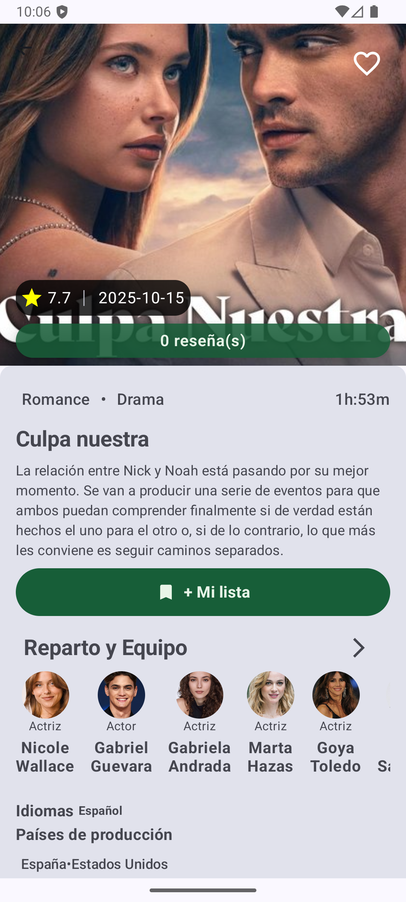

# Episodic — App Android (Kotlin, Jetpack Compose)

[](https://developer.android.com/)
[](https://kotlinlang.org/)
[](https://developer.android.com/jetpack/compose)
[](https://developer.android.com/)
[](LICENSE)
[](https://github.com)

Aplicación Android nativa para explorar películas y series usando la API de TMDB. Construida con arquitectura MVVM, Jetpack Compose y Hilt.

---

## 📱 Capturas de pantalla

| Inicio                  | Detalle                   | Explorar                   | Listas                   |
| ----------------------- | ------------------------- | -------------------------- | ------------------------ |
|  |  |  |  |

---

## Tabla de contenido

- **[Descripción](#descripción)**
- **[Características](#características)**
- **[Arquitectura](#arquitectura)**
- **[Stack técnico](#stack-técnico)**
- **[Estructura del proyecto](#estructura-del-proyecto)**
- **[Requisitos](#requisitos)**
- **[Configuración](#configuración)**
- **[Instalación y ejecución](#instalación-y-ejecución)**
- **[Comandos útiles](#comandos-útiles)**
- **[Contribuir](#contribuir)**
- **[Calidad y pruebas](#calidad-y-pruebas)**
- **[Solución de problemas](#solución-de-problemas)**
- **[Roadmap](#roadmap)**
- **[Créditos y avisos](#créditos-y-avisos)**
- **[Términos y condiciones](#términos-y-condiciones)**
- **[Estado del proyecto](#estado-del-proyecto)**

---

## Descripción

Episodic permite descubrir y visualizar información detallada de películas: sinopsis, reparto, calificaciones, géneros y reseñas. La app consume la API pública de The Movie Database (TMDB) y está diseñada con una arquitectura limpia, desacoplada y preparada para escalar con nuevas funcionalidades como series de TV, favoritos y filtrados avanzados.

- **Paquete**: `com.app.episodic`
- **Min SDK**: 24 (Android 7.0+)
- **Target/Compile SDK**: 36
- **Versión**: 1.0

---

## ✨ Características

- 🏠 **Inicio**: Tendencias, descubrimiento, barra de búsqueda, carrusel destacado y filtros por género.
- 🎬 **Detalle de película**: Ficha completa con reparto, géneros, reseñas y producción.
- 🔍 **Explorar**: Sección dedicada a descubrimiento de contenido con filtrado avanzado.
- 📋 **Mis listas**: Vistas para colecciones personalizadas y gestión de favoritos.
- 🧭 **Navegación**: Bottom navigation con rutas tipadas y transiciones suaves.
- 🎨 **Diseño moderno**: Interfaz atractiva con Material Design 3 y animaciones suaves.
- 🌙 **Tema oscuro/claro**: Soporte completo para ambos temas.
- ⚡ **Rendimiento**: Carga optimizada con indicadores visuales mejorados.

---

## Arquitectura

- **MVVM + Clean Architecture**
  - `Presentation`: Jetpack Compose (UI) + ViewModels (estado con StateFlow)
  - `Domain`: modelos y contratos de repositorios
  - `Data`: Retrofit/OkHttp, mapeadores y repositorios
- **Inyección de dependencias**: Hilt (módulos en `app/src/main/java/com/app/episodic/di/`)
- **Serialización**: Kotlinx Serialization
- **Imágenes**: Coil

---

## Stack técnico

- AndroidX Core, Lifecycle, Activity Compose, Navigation Compose
- Jetpack Compose BOM y Material 3
- Retrofit 2 + OkHttp 4
- Kotlinx Serialization 1.x
- Hilt 2.x (con `kapt`)
- Firebase (BOM 34.3.0) opcional

Referencias exactas en `app/build.gradle.kts` y `gradle/libs.versions.toml` (si aplica).

---

## Estructura del proyecto

Estructura simplificada:

```
app/src/main/java/com/app/episodic/
├── MainActivity.kt
├── ui/
│   ├── home/               # Inicio: carrusel, géneros, listas
│   ├── detail/             # Detalle de película (cast, reviews)
│   ├── explore/            # Explorar
│   ├── lists/              # Listas y creación de listas
│   ├── mylists/            # Mis listas
│   ├── components/         # Reutilizables (LoadingView, etc.)
│   ├── navigation/         # Graphs, rutas y bottom bar
│   └── theme/              # Theming (Material 3)
├── movie/                  # Módulo de películas (data/domain)
├── movie_detail/           # Módulo de detalle (data/domain)
├── di/                     # Módulos Hilt
├── common/                 # Utilidades comunes
└── utils/                  # Extensiones, constantes, Response wrapper
```

Consulta el desglose completo en los archivos del repositorio.

---

## Requisitos

- Android Studio (Giraffe o superior recomendado)
- JDK 11
- Dispositivo o emulador Android API 24+
- Clave de API de TMDB
- Opcional: configuración de Firebase (`google-services.json` en `app/`)

---

## Configuración

1. TMDB API Key (requerido)

La clave se inyecta vía `BuildConfig.API_KEY` desde `local.properties` (no versionado):

```properties
# archivo: local.properties (en la raíz del proyecto)
API_KEY=TU_API_KEY_DE_TMDB
```

El `build.gradle.kts` del módulo `app` la expone con:

```kotlin
defaultConfig {
    // ...
    buildConfigField("String", "API_KEY", "\"$apiKey\"")
}
```

---

## Instalación y ejecución

1. Clonar el repositorio.
2. Abrir el proyecto en Android Studio y esperar la sincronización de Gradle.
3. Crear/editar `local.properties` en la raíz y añadir `API_KEY` de TMDB.
4. Seleccionar un dispositivo/emulador (API 24+).
5. Ejecutar la app desde Android Studio o con Gradle.

---

## Comandos útiles

```bash
# Compilar y ejecutar (desde Android Studio es lo recomendado)
./gradlew :app:assembleDebug
./gradlew :app:installDebug

# Lint y verificación
./gradlew :app:lint
./gradlew :app:assembleRelease
```

---

## 🤝 Contribuir

¡Las contribuciones son bienvenidas! Por favor sigue estos pasos:

### Proceso de contribución

1. **Fork** el proyecto
2. Crea una rama para tu feature (`git checkout -b feature/AmazingFeature`)
3. Commit tus cambios (`git commit -m 'Add some AmazingFeature'`)
4. Push a la rama (`git push origin feature/AmazingFeature`)
5. Abre un Pull Request

### Áreas de mejora

- 🐛 **[FÁCIL]** Issues etiquetados como `good first issue`
- 🎨 **[FÁCIL]** Mejoras de UI/UX
- 📚 **[FÁCIL]** Documentación
- ⚡ **[MEDIO]** Optimizaciones de rendimiento
- 🧪 **[MEDIO]** Tests unitarios e integración

### Estándares de código

- Sigue la guía de estilo de Kotlin
- Usa nombres descriptivos para variables y funciones
- Añade comentarios en lógica compleja
- Prueba tu código antes de hacer push

---

## Calidad y pruebas

- Estado actual: sin suite de tests incluida en este repo. Ver [Roadmap](#roadmap).
- Recomendado: añadir tests unitarios (ViewModels, mapeadores) y de UI (Compose).

---

## Solución de problemas

- **API Key vacía en runtime**: verifica que `local.properties` contiene `API_KEY` y que no tiene comillas extra ni espacios.
- **401/403 desde TMDB**: confirma que la clave es válida y que el dispositivo tiene red.
- **Error de compatibilidad de compilación**: asegúrate de usar JDK 11 y Android Gradle Plugin compatibles.
- **Fallo con Firebase**: revisa la presencia de `app/google-services.json` y que el paquete `applicationId` coincida.

---

## Roadmap

- **Series de TV**: endpoints y vistas dedicadas.
- **Búsqueda avanzada** con TMDB.
- **Favoritos** con almacenamiento local.
- **Filtros por género/año/calificación/idioma** y paginación.
- **Caching (Room)** y soporte offline.
- **Testing** unitario y de UI.
- **Accesibilidad, performance y animaciones**.

---

## Créditos y avisos

- Este producto utiliza la API de TMDB pero no está avalado ni certificado por TMDB.
- Bibliotecas: Retrofit, OkHttp, Kotlinx Serialization, Hilt, Jetpack Compose, Coil, AndroidX, Firebase BOM.

---

## Términos y condiciones

- Consulta `docs/terminosycondiciones-episodic.pdf`.

---

## Estado del proyecto

- Versión funcional centrada en películas y series. Varias mejoras planificadas (ver Roadmap).
